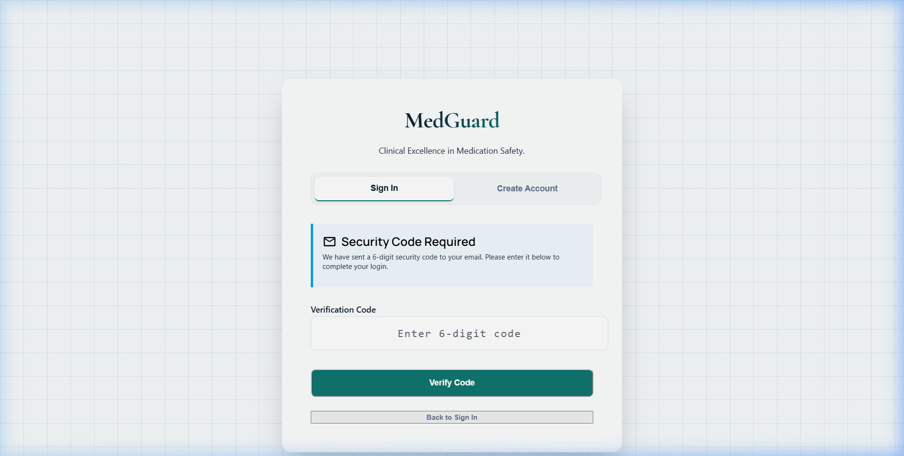
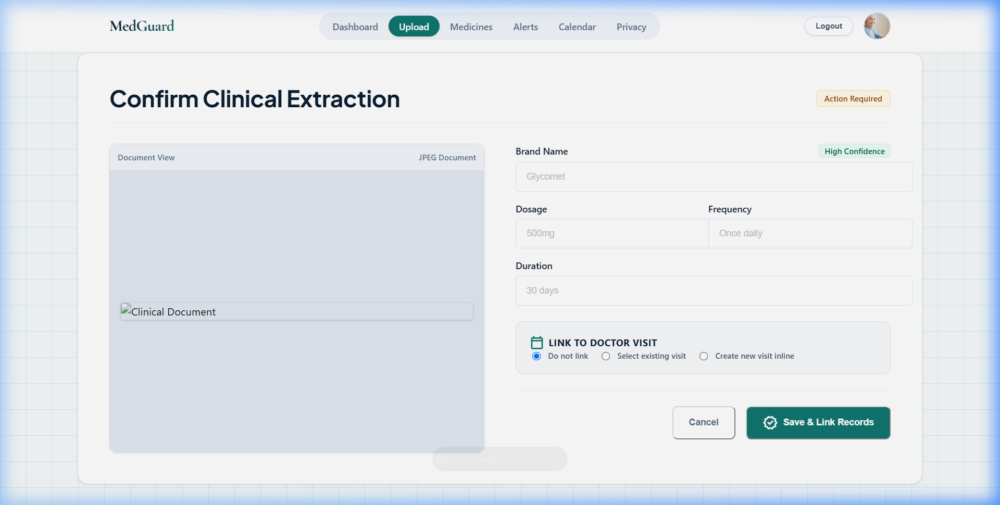
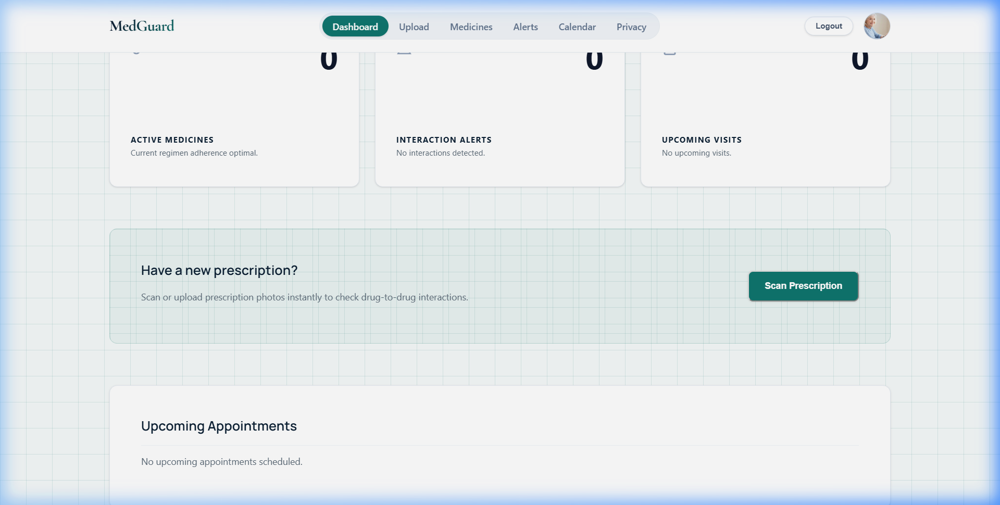
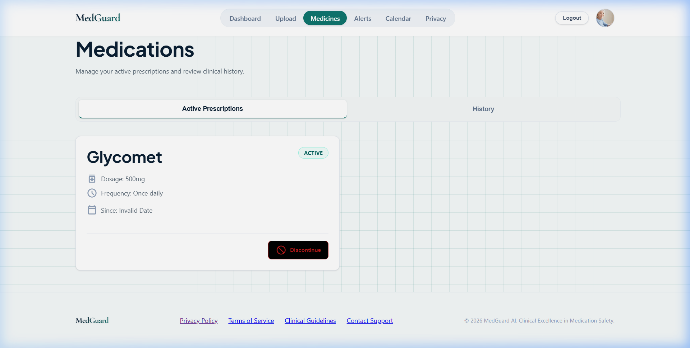

# 🛡️ MedGuard

> **MedGuard** is an AI-powered medication safety and visit-preparation platform for chronic-condition patients and their family caregivers. Photograph prescriptions, get automatically warned of dangerous drug interactions, and keep caregivers synchronized in real-time.

---

## 🖼️ Application Showcase

Here is a visual walk-through of MedGuard's premium clinical interface:

| 🔐 1. 2-Step Verification (MFA) | 🔍 2. AI Clinical Extraction Review |
|:---:|:---:|
|  |  |
| Secure login requiring a 6-digit OTP with a resend utility and input contrast corrections. | Vision LLM extracts brand/generic mapping and dosage instructions with confidence metrics. |

| 📊 3. Unified Patient Dashboard | 💊 4. Active Prescription List |
|:---:|:---:|
|  |  |
| Dynamic overview containing medications, drug interactions, lab reports, and calendar events. | Mapped medication regimen displaying brand names, generic names, and dosage rules. |

---

## 🎯 What It Does

1. **AI Prescription Extraction & Safety**: Upload a prescription photo ➜ AI extracts medicine details ➜ resolves Indian brand names to generics ➜ checks interactions against a curated knowledge base ➜ alerts patient + caregiver in plain language.
2. **Real-Time Asynchronous Pipeline**: Uploads are processed asynchronously via a BullMQ worker queue with real-time progress updates streamed to the frontend via Server-Sent Events (SSE).
3. **MFA Login & Security**: Multi-factor authentication is enforced at login. Invalid codes can be re-sent directly without resetting forms.
4. **Caregiver OTP Linking**: Single-use caregiver link codes bind caregivers and patients securely.
5. **Visit Preparation**: Upload lab reports ➜ track trends over time (elevation check on HbA1c/TSH) ➜ generate briefs with doctor questions.

---

## 🏗️ Architecture & Ports

| Service | Technology Stack | Default Port | Role |
|:---|:---|:---|:---|
| **ms1-core-api** | Express.js + pg + BullMQ | `4000` | Auth, DB connection, deterministic logic, async queues |
| **ms2-agent-service** | FastAPI + LangGraph | `8000` | Vision LLM extraction, brand resolution, brief generation |
| **frontend** | React + Vite + Vanilla CSS | `5173` | Patient & Caregiver web portal |
| **PostgreSQL** | PostgreSQL 16 | `5432` | System of record |
| **NGINX** | nginx:alpine | `80` | Reverse proxy and SSL termination |

---

## 🚀 Quick Start

### Prerequisites
- [Docker](https://docs.docker.com/get-docker/) & [Docker Compose](https://docs.docker.com/compose/install/)
- [Node.js 20+](https://nodejs.org/) (for local development)

### Boot Services with Docker
```bash
# 1. Clone the repository
git clone https://github.com/Sarveshero3/MedGuard.git
cd MedGuard

# 2. Copy environment template
cp .env.example .env

# 3. Boot all services
docker-compose up --build
```
Once booted, the reverse proxy exposes the app at `http://localhost`.

### Run Services Locally for Development
1. **ms1 — Express Backend**:
   ```bash
   cd ms1-core-api
   npm install
   npm start
   ```
   *Note: If no local PostgreSQL or Redis is running, the backend automatically falls back to an in-memory database store and queue simulation, keeping the SSE streams fully functional.*

2. **Frontend — React Client**:
   ```bash
   cd frontend
   npm install
   npm run dev
   ```

---

## 📁 Project Structure

```
MedGuard/
├── ms1-core-api/          # Express.js backend & BullMQ worker
├── ms2-agent-service/     # FastAPI + LangGraph assessment graphs
├── frontend/              # React + Vite client (high-contrast inputs)
├── infra/
│   ├── nginx/             # NGINX reverse proxy configs
│   └── db/                # PostgreSQL schemas
├── docs/                  # Project specifications & screenshots
└── docker-compose.yml     # Container orchestration
```

---

## 📚 Technical Documentation

- [`docs/prd.md`](docs/prd.md) — Product Requirements Document
- [`docs/techspec.md`](docs/techspec.md) — Architecture & API specs
- [`docs/auth.md`](docs/auth.md) — Security & MFA definitions
- [`docs/schema.md`](docs/schema.md) — Database design & structures
- [`docs/lessons.md`](docs/lessons.md) — Key design learnings & reviews

---

## 🔐 Security & Hardening
- **MFA (2-Step Verification)** on user logins with secure session tokens.
- **Single-use Caregiver Link Codes** to enforce private caregiver boundaries.
- **IDOR Protection** validating patient ownership records before read/write.
- **Autofill Contrast Correction** fixing low-contrast blurred text in Chrome/Edge browsers.
- **Rate limiting** and sanitization to prevent injection and brute-force access.

---

## 📜 License
[MIT](LICENSE)