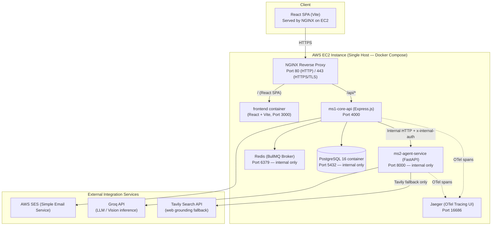

# MedGuard System Architecture & Deployment Guide

This document defines the system architecture, network topologies, security boundaries, and production deployment configurations for MedGuard.

---

## 1. System Architecture



> **Note on S3**: AWS S3 is **not currently implemented**. Document files are stored as temporary files during extraction and then deleted. The `source_photo_id` column in `medicines` and `lab_reports` is a placeholder field. If persistent photo storage is required in future, S3 integration would be added here.

---

## 2. Microservice Descriptions

### ms1-core-api (Node.js + Express)
- **Path**: `ms1-core-api/`
- **Role**: Coordinates authentication, stores user/caregiver profiles, manages clinical consent, stores medication lists and lab values, runs the deterministic drug interaction lookup engine, and dispatches background tasks via BullMQ.
- **Port**: `4000` (internal; all external requests route via NGINX at `/api`).

### ms2-agent-service (Python + FastAPI)
- **Path**: `ms2-agent-service/`
- **Role**: Executes LangGraph AI workflows for vision-based prescription OCR, generic-name resolution (brand → active ingredient via Groq LLM + Tavily fallback), lab report parsing, doctor-visit brief writing, and patient Q&A.
- **Port**: `8000` (strictly internal; all `/api/extract/*` routes require `x-internal-auth: <MS2_INTERNAL_SECRET>` header — enforced by FastAPI middleware in `app/main.py`). ms2 never receives user JWTs and makes no authorization decisions.

### PostgreSQL (Container)
- **Image**: `postgres:16-alpine`
- **Role**: System of record for all clinical and user data.
- **Deployment**: Runs as a Docker container on the same EC2 host. **This is not AWS RDS.** Data is persisted via a named Docker volume (`postgres_data`). The container is exposed only on `127.0.0.1:5432` — not publicly reachable.

### Redis (Container)
- **Image**: `redis:7-alpine`
- **Role**: BullMQ job queue broker and idempotency cache.
- **Deployment**: Container, exposed only on `127.0.0.1:6379`.

### Jaeger (Container)
- **Image**: `jaegertracing/all-in-one:1.57`
- **Role**: OpenTelemetry trace collection and visualization UI.
- **Ports**: OTLP gRPC on `4317` (internal); Jaeger UI on `16686`.
- Both `ms1-core-api` and `ms2-agent-service` export OTel spans to Jaeger via `OTEL_EXPORTER_OTLP_ENDPOINT=http://jaeger:4317`. Tracing is confirmed operational in production.

---

## 3. Production Deployment (AWS EC2 — Single Host)

All services (frontend, API, agent, database, queue, tracing, reverse proxy) run as Docker containers on a **single AWS EC2 instance** orchestrated by Docker Compose.

### A. Frontend Serving (NGINX on EC2)
The React SPA is **not deployed on Vercel**. It runs as a Docker container (`frontend` service, Vite dev/build server on port 3000) and is reverse-proxied by NGINX:

```nginx
# nginx.conf — / routes to the frontend container
location / {
    proxy_pass http://frontend:3000;
}

# /api/ routes to ms1-core-api
location /api/ {
    proxy_pass http://ms1-core-api:4000;
}
```

The `vercel.json` file in `frontend/` is a leftover development artifact (it points to `localhost:4000`) and is **not used** in the production deployment.

### B. Database (PostgreSQL Container — Not RDS)
PostgreSQL runs as a container on the EC2 instance. There is **no AWS RDS instance**. The `DATABASE_URL` points to the internal Docker network hostname `postgres:5432`. Data is persisted in the `postgres_data` named volume.

### C. Email Dispatch (AWS SES)
All transactional emails (email verification codes, MFA codes, caregiver invitations) are dispatched via **AWS SES**:
- Sending identity: `noreply@medguard.living` (DKIM-verified, region `ap-south-1`).
- The `ms1-core-api` uses `@aws-sdk/client-ses` SDK (`SendEmailCommand`).
- **SES Sandbox limitation**: As of July 2026, the account remains in Sandbox mode (support case ID 178446489800777). Only manually verified email addresses receive emails. Sends to unverified addresses fail with `MessageRejected` — logged as `EMAIL_SEND_FAILED` with `isSandboxRejection: true`.

### D. Domain and DNS Routing
- The custom domain `medguard.living` is configured.
- **DNS Record**: Single `A Record` pointing `medguard.living` (and/or `www.medguard.living`) to the EC2 Public Elastic IP.
- There is **no separate Vercel CNAME** — the frontend is served from the same EC2 host as the API.
- **SSL Certificates**: Let's Encrypt certificates are provisioned via Certbot. The NGINX container mounts `/etc/letsencrypt` to terminate TLS (ports 80 and 443 are both exposed).

### E. Network Security
- Security Groups block public access to internal ports: `4000` (ms1), `8000` (ms2), `5432` (PostgreSQL), `6379` (Redis).
- Only ports `80` (HTTP) and `443` (HTTPS) on NGINX are publicly accessible.
- The `backend` Docker network is marked `internal: true`, preventing ms2 and PostgreSQL from making arbitrary outbound connections.
