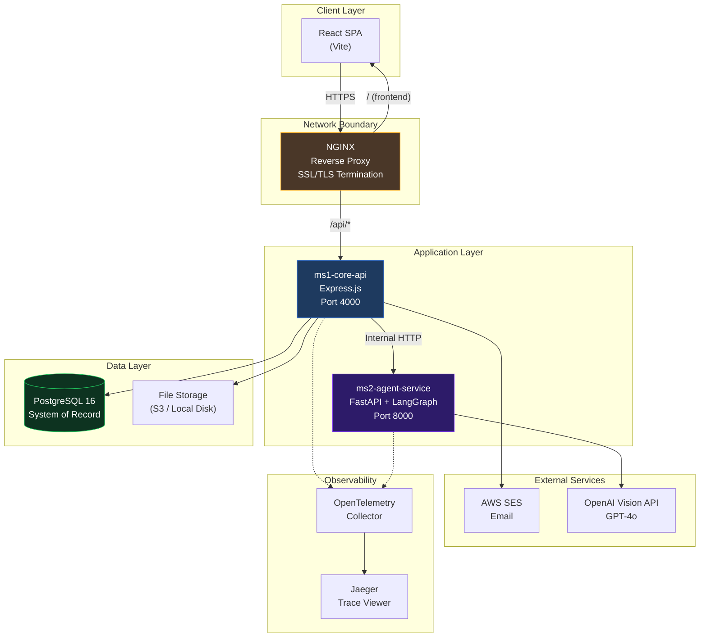
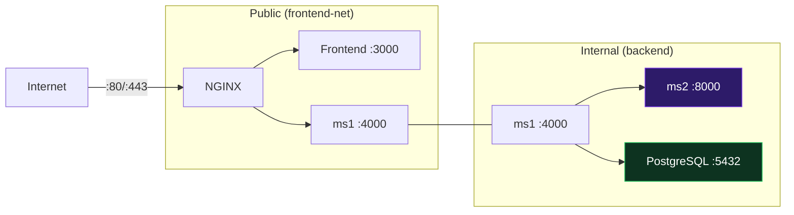
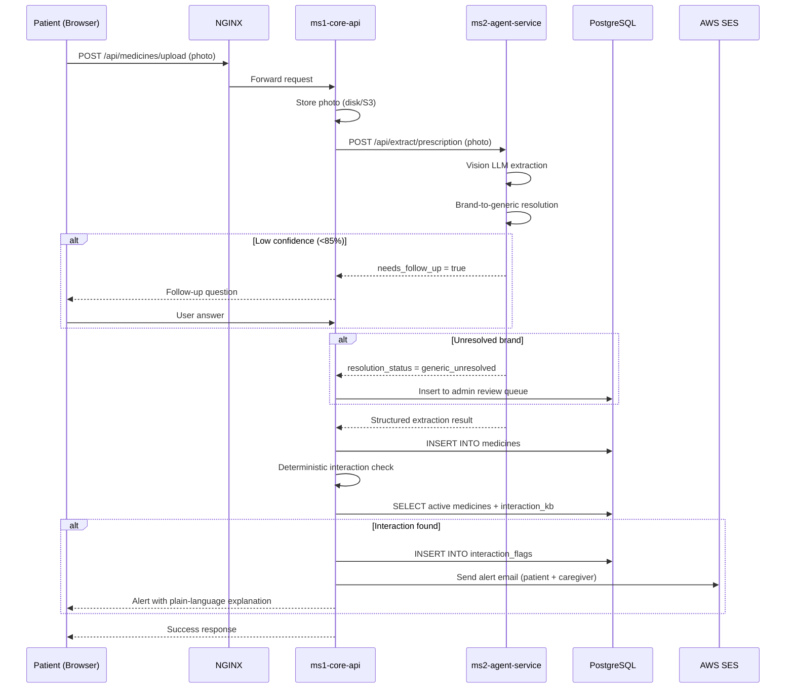
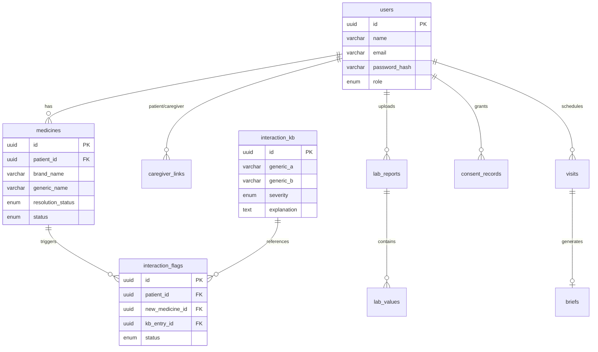

# MedGuard System Architecture

This document defines the production architecture for MedGuard's microservices platform.

---

## 1. Architecture Overview



---

## 2. Service Responsibilities

### ms1-core-api (Express.js)
> **Owns**: Database, Auth, Deterministic Logic, Side-effects

| Responsibility | Details |
|:---|:---|
| Authentication | JWT login/refresh with `patient`, `caregiver`, `admin` roles |
| Medicine lifecycle | CRUD on `medicines` table, status management |
| Interaction engine | Deterministic lookup against `interaction_kb` — pure, tested module |
| Caregiver flows | Invitation, linking, permission tiers |
| Email dispatch | AWS SES for alerts, confirmations, weekly summaries |
| Admin dashboard API | Review queue, versioned KB/brand-map editors |
| DPDP compliance | Consent logging, data deletion |
| File storage | Upload handling (multer), photo ID management |

### ms2-agent-service (FastAPI + LangGraph)
> **Owns**: AI Extraction, Natural Language Generation

| Responsibility | Details |
|:---|:---|
| Prescription Assessment Graph | Vision extraction → confidence scoring → follow-up question |
| Brand-to-Generic Resolution | Mapping lookup against DB data (passed by ms1) |
| Lab Report Extraction Graph | Parse lab values from report photos |
| Visit-Brief Writer Graph | Generate plain-language brief with suggested questions |

> [!IMPORTANT]
> ms2 is **strictly internal**. It never writes to the database, sends emails, or performs any side-effects. It receives data, processes it, and returns structured JSON to ms1.

---

## 3. Network Topology



- **frontend-net**: Bridge network connecting NGINX, frontend, and ms1
- **backend**: Internal bridge network (no external access) connecting ms1, ms2, and PostgreSQL
- ms2 and PostgreSQL are **never directly reachable** from the internet

---

## 4. Data Flow — Medicine Add



---

## 5. Database Schema Overview

See [schema.md](file:///c:/Users/Sarvesh/Desktop/hackathon/MedGuard/docs/schema.md) for full table definitions.



---

## 6. Security Boundaries

| Control | Implementation |
|:---|:---|
| **Authentication** | JWT with role claims (`patient`, `caregiver`, `admin`) |
| **Authorization** | Role-based middleware on every route |
| **Network isolation** | ms2 + PostgreSQL on internal Docker network |
| **Upload limits** | 8MB max (NGINX + Express) |
| **DPDP compliance** | Explicit consent at signup, audit log, delete-my-data route |
| **EXIF stripping** | Removed in ms2 before processing |
| **Append-only data** | `interaction_kb` and `brand_generic_map` have DB triggers preventing UPDATE/DELETE |
| **HTTPS** | Certbot SSL/TLS at NGINX (production) |

---

## 7. Observability

| Component | Tool |
|:---|:---|
| Distributed tracing | OpenTelemetry SDK in ms1 + ms2 |
| Trace visualization | Jaeger (self-hosted in docker-compose) |
| Span attributes | `cost_per_check`, `confidence_score`, `model_name` |
| Logging | morgan (ms1) + uvicorn (ms2) → stdout |

---

## 8. Directory Structure

```
MedGuard/
├── ms1-core-api/          # Express.js — auth, DB, deterministic logic
│   ├── src/
│   │   ├── config/        # DB pool, env loading
│   │   ├── middleware/     # auth, errors, validation
│   │   ├── routes/        # Express routers
│   │   ├── services/      # Business logic modules
│   │   ├── models/        # DB query helpers
│   │   └── utils/         # Shared utilities
│   ├── tests/
│   └── Dockerfile
│
├── ms2-agent-service/     # FastAPI + LangGraph — AI extraction
│   ├── app/
│   │   ├── api/           # FastAPI routers
│   │   ├── graphs/        # LangGraph graph definitions
│   │   ├── services/      # Brand resolution, extraction
│   │   └── schemas/       # Pydantic models
│   ├── tests/
│   └── Dockerfile
│
├── frontend/              # React + Vite
│   ├── src/
│   │   ├── pages/         # Route-level components
│   │   ├── components/    # Reusable UI
│   │   ├── context/       # Auth state
│   │   └── services/      # API client
│   └── Dockerfile
│
├── infra/
│   ├── nginx/nginx.conf   # Reverse proxy
│   └── db/init.sql        # PostgreSQL schema v1
│
├── docs/                  # Project documentation
├── skills/                # Agent skills
├── docker-compose.yml     # Full stack orchestration
└── .github/workflows/     # CI pipeline
```
