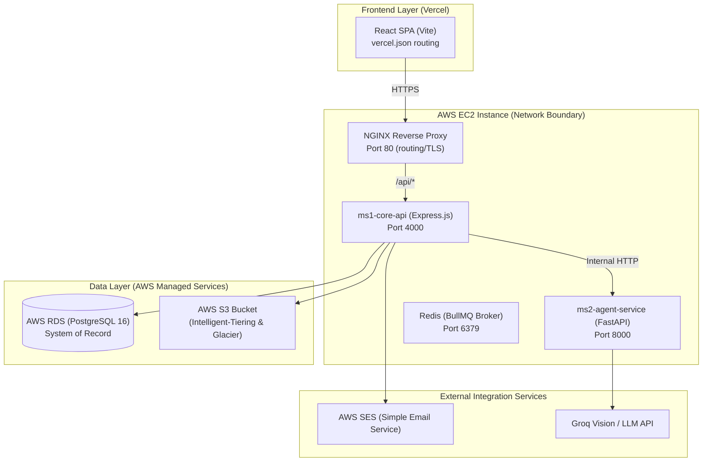

# MedGuard System Architecture & Deployment Guide

This document defines the system architecture, network topologies, security boundaries, and production deployment configurations for MedGuard.

---

## 1. System Architecture



---

## 2. Microservice Descriptions

### ms1-core-api (Node.js + Express)
- **Path**: `ms1-core-api/`
- **Role**: Coordinates authentication, stores user/caregiver profiles, manages clinical consent, stores medication lists and lab values, runs the deterministic drug interaction lookup engine, and dispatches background tasks.
- **Port**: `4000` (Internal access only; external requests routed via NGINX proxy `/api`).

### ms2-agent-service (Python + FastAPI)
- **Path**: `ms2-agent-service/`
- **Role**: Executes LangGraph AI workflows for vision-based prescription OCR, generic-name resolution, doctor-visit brief writing, lab report parsing, and patient Q&A.
- **Port**: `8000` (Strictly internal; accessible only by `ms1-core-api`).

---

## 3. Production Deployment Guide (AWS & Vercel)

As per the Milestone guidelines, the production deployment is split between Vercel (for frontend) and AWS (for backend services).

### A. Frontend Deployment (Vercel)
The React single-page app (SPA) is deployed on **Vercel** for optimal performance, edge caching, and scalability.
- **Client-Side Routing**: Vite React Router requires all paths to route through `index.html`. We configure this using [vercel.json](file:///c:/Users/Sarvesh/Desktop/hackathon/MedGuard/frontend/vercel.json):
  ```json
  {
    "rewrites": [
      { "source": "/api/:path*", "destination": "http://<EC2_PUBLIC_IP>:4000/api/:path*" },
      { "source": "/(.*)", "destination": "/index.html" }
    ]
  }
  ```
- **Axios Configuration**: The HTTP client in [api.js](file:///c:/Users/Sarvesh/Desktop/hackathon/MedGuard/frontend/src/services/api.js) resolves base paths to `/api`, which Vercel proxies directly to the AWS EC2 instance.

### B. Backend Deployment (AWS EC2 & RDS)
The backend services run on an **AWS EC2** instance, with data persisted in **AWS RDS**.
1. **AWS EC2 (Virtual Server)**:
   - Launches a standard Ubuntu Server on an EC2 instance (e.g., `t3.micro` or `t3.small` to stay within free tier).
   - Installs Docker and Docker Compose to containerize `ms1-core-api`, `ms2-agent-service`, and `Redis`.
   - Security Groups block public access to ports `4000`, `8000`, and `6379`. Only port `80` (NGINX) is open to the public.
2. **AWS RDS (PostgreSQL Database)**:
   - Spawns a managed PostgreSQL 16 instance.
   - Enforces RDS security groups to accept traffic exclusively from the EC2 instance's private IP.
   - The connection URI is injected as `DATABASE_URL` into the EC2 environment.

### C. Object Storage (AWS S3)
To minimize operational costs while satisfying clinical audit guidelines, document uploads (prescriptions and lab reports) are stored in an **AWS S3 Bucket**:
- **Intelligent-Tiering**: Used for active patient uploads. Automatically moves files between frequent and infrequent access tiers based on usage patterns to reduce access costs.
- **Glacier Deep Archive**: A lifecycle policy automatically transitions files older than 90 days to Glacier. This is ideal for archiving historical clinical documents that are rarely accessed but must be retained for compliance.

### D. Email Dispatch (AWS SES)
All transactional emails (email verification codes, multi-factor authentication codes, caregiver invitations, and critical drug-drug interaction alerts) are dispatched via **AWS SES**:
- The domain is verified in AWS Route 53 with SPF, DKIM, and DMARC records to prevent spoofing.
- The `ms1-core-api` utilizes the `@aws-sdk/client-ses` SDK to send emails via SES.

### E. Domain and DNS Routing
- A custom domain is purchased (e.g., via Amazon Route 53, GoDaddy, or Namecheap).
- **DNS Records**:
  - `A Record` pointing `api.yourdomain.com` to the EC2 Public Elastic IP.
  - `CNAME Record` pointing `www.yourdomain.com` to the Vercel deployment address.
- **SSL Certificates**: Let's Encrypt certificates are provisioned on the EC2 instance using Certbot to terminate SSL at NGINX for HTTPS traffic, ensuring fully encrypted transits (TLS 1.3).
