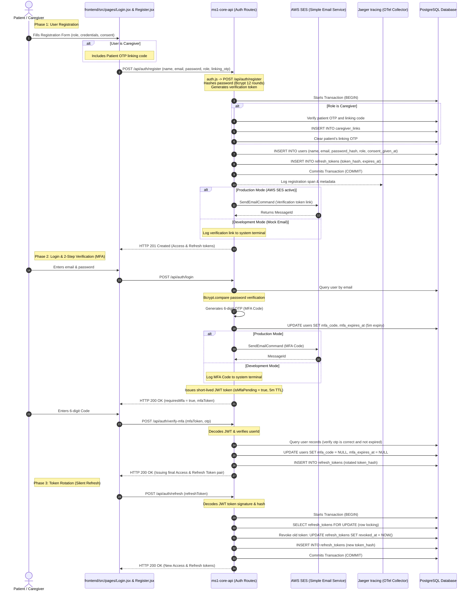

# MedGuard Auth, Telemetry, and AWS Services Flow

This document details the registration, login (including 2-Step verification / MFA), JWT token rotation, OpenTelemetry/Jaeger tracing context propagation, and AWS SES (Simple Email Service) integrations.

---

## 1. Auth & Notification Sequence Diagram

---

## 2. In-Depth Flow Walkthrough

### 1. User Registration Flow
- **Source File**: [auth.js](../ms1-core-api/src/routes/auth.js#L65-L201)
- **Logic**:
  - Checks if the email is already registered in the `users` table. If so, aborts early returning HTTP 409.
  - Generates salt and hashes the password using Bcrypt with 12 rounds.
  - Begins a database transaction (`BEGIN`):
    - **Caregiver Path**: Checks patient's linking OTP against active users. If valid and not expired, establishes the association in the `caregiver_links` table and clears the OTP.
    - Inserts user details into the `users` table, saving user preferences and setting `consent_given_at = NOW()` (recording clinical data processing consent).
    - Calls `issueTokenPair()`:
      - Creates a standard JWT access token with user details (id, email, name, role) with a 15-minute TTL.
      - Creates a refresh token with a random `jti` identifier and 7-day TTL.
      - Hashes the refresh token using SHA-256 and writes it to `refresh_tokens`.
    - Commits the database transaction (`COMMIT`).
  - **AWS SES Email Dispatch**: Initiates email verification routing. In production, imports `@aws-sdk/client-ses` dynamically, constructs an instance of `SESClient` using environment configuration (AWS region, credentials), and dispatches a `SendEmailCommand` to send the link.

### 2. User Login & 2-Step Verification (MFA)
- **Source File**: [auth.js](../ms1-core-api/src/routes/auth.js#L203-L353)
- **Logic**:
  - Verifies user email existence and parses credentials using Bcrypt password matching.
  - Generates a 6-digit random code: `Math.floor(100000 + Math.random() * 900000).toString()`.
  - Saves the code and expiry time (5-minute TTL) in the user's table row.
  - Dispatches the MFA code to the user's email via AWS SES.
  - Returns a temporary JWT token containing `isMfaPending: true` with a 5-minute TTL to the client.
  - **Verification**: The client submits the code and pending token to `/api/auth/verify-mfa`.
    - Verifies the JWT signature and claims.
    - Checks the database to confirm the code matches and hasn't expired.
    - Clears the database verification fields and issues the final long-lived access and refresh token pair.

### 3. OpenTelemetry (OTel) Telemetry Propagation
- **Configuration**: `docker-compose.yml` configures service endpoints with `OTEL_EXPORTER_OTLP_ENDPOINT: http://jaeger:4317`.
- **Trace Context Sharing**:
  - Tracing spans are linked across asynchronous service boundaries (e.g. background extraction workers).
  - The Express upload route initializes a `_traceparent` context header in standard OTel format: `00-{traceId}-{spanId}-01`.
  - This is passed within the BullMQ job payload.
  - The background consumer worker extracts `traceId` and `parentSpanId`, generates a new child span ID, and links its logs back to the parent trace, writing to the Jaeger tracing container.

### 4. AWS SES (Simple Email Service) Integration
- **Source File**: [email.js](../ms1-core-api/src/utils/email.js)
- **Logic**:
  - The email utility evaluates `process.env.NODE_ENV`.
  - In development or test environments, it outputs messages directly to the system console log.
  - In production, it checks environment credentials (`AWS_SES_REGION` and `AWS_SES_FROM_ADDRESS`), imports `@aws-sdk/client-ses`, instantiates the client, and sends the message using `SendEmailCommand`.
