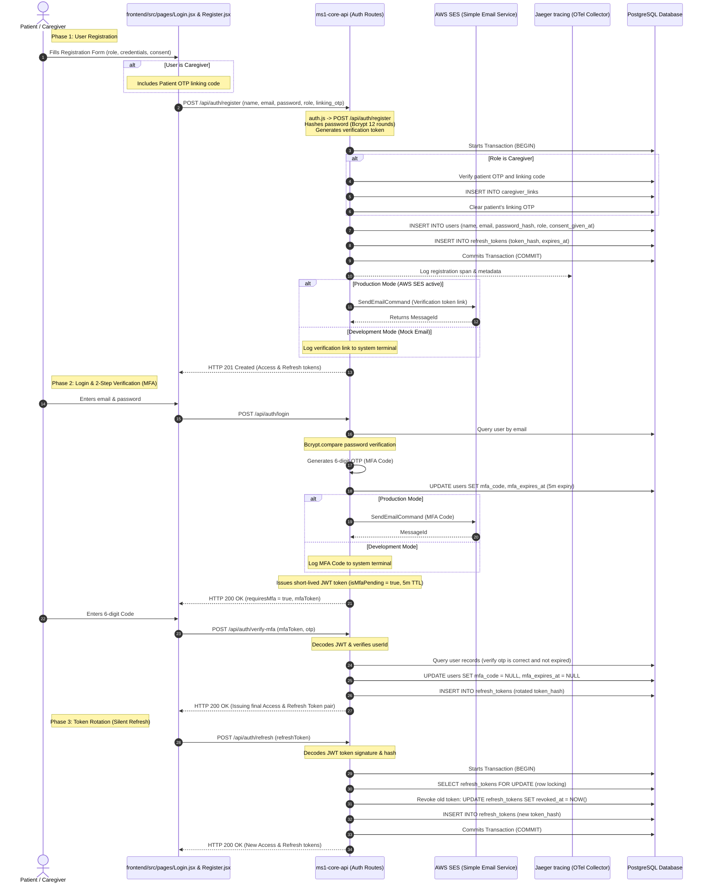
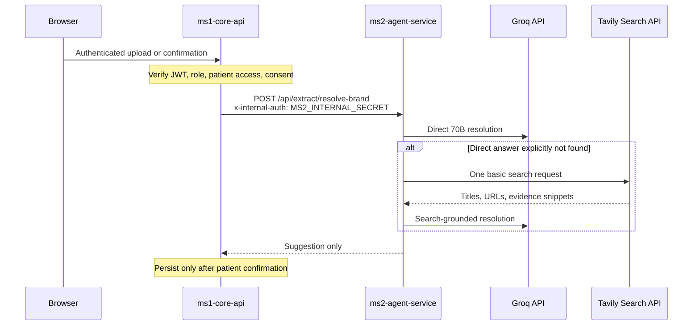

# MedGuard Auth, Telemetry, and AWS Services Flow

This document details the registration, login (including 2-Step verification / MFA), JWT token rotation, OpenTelemetry/Jaeger tracing context propagation, and AWS SES (Simple Email Service) integrations.

---

## 1. Auth & Notification Sequence Diagram



---

## 2. In-Depth Flow Walkthrough

### 1. User Registration Flow
- **Source File**: [auth.js](../ms1-core-api/src/routes/auth.js#L65-L201)
- **Logic**:
  - Checks if the email is already registered in the `users` table. If so, aborts early returning HTTP 409.
  - Generates salt and hashes the password using Bcrypt with 12 rounds.
  - Begins a database transaction (`BEGIN`):
    - **Caregiver Path**: Checks patient's linking OTP against active users. If valid and not expired, establishes the association in the `caregiver_links` table and clears the OTP.
    - Inserts user details into the `users` table, saving user preferences and setting `consent_given_at = NOW()` (recording clinical data processing consent).
    - Calls `issueTokenPair()`:
      - Creates a standard JWT access token with user details (id, email, name, role) with a 15-minute TTL.
      - Creates a refresh token with a random `jti` identifier and 7-day TTL.
      - Hashes the refresh token using SHA-256 and writes it to `refresh_tokens`.
    - Commits the database transaction (`COMMIT`).
  - **AWS SES Email Dispatch**: Initiates email verification routing. In production, imports `@aws-sdk/client-ses` dynamically, constructs an instance of `SESClient` using environment configuration (AWS region, credentials), and dispatches a `SendEmailCommand` to send the link.

### 2. User Login & 2-Step Verification (MFA)
- **Source File**: [auth.js](../ms1-core-api/src/routes/auth.js#L203-L353)
- **Logic**:
  - Verifies user email existence and parses credentials using Bcrypt password matching.
  - Generates a 6-digit random code: `Math.floor(100000 + Math.random() * 900000).toString()`.
  - Saves the code and expiry time (5-minute TTL) in the user's table row.
  - Dispatches the MFA code to the user's email via AWS SES.
  - Returns a temporary JWT token containing `isMfaPending: true` with a 5-minute TTL to the client.
  - **Verification**: The client submits the code and pending token to `/api/auth/verify-mfa`.
    - Verifies the JWT signature and claims.
    - Checks the database to confirm the code matches and hasn't expired.
    - Clears the database verification fields and issues the final long-lived access and refresh token pair.

### 3. OpenTelemetry (OTel) Telemetry Propagation
- **Configuration**: `docker-compose.yml` configures service endpoints with `OTEL_EXPORTER_OTLP_ENDPOINT: http://jaeger:4317`.
- **Trace Context Sharing**:
  - Tracing spans are linked across asynchronous service boundaries (e.g. background extraction workers).
  - The Express upload route initializes a `_traceparent` context header in standard OTel format: `00-{traceId}-{spanId}-01`.
  - This is passed within the BullMQ job payload.
  - The background consumer worker extracts `traceId` and `parentSpanId`, generates a new child span ID, and links its logs back to the parent trace, writing to the Jaeger tracing container.

### 4. AWS SES (Simple Email Service) Integration
- **Source File**: [email.js](../ms1-core-api/src/utils/email.js)
- **Logic**:
  - The email utility evaluates `process.env.NODE_ENV`.
  - In development or test environments, it outputs messages directly to the system console log.
  - In production, it checks environment credentials (`AWS_SES_REGION` and `AWS_SES_FROM_ADDRESS`), imports `@aws-sdk/client-ses`, instantiates the client, and sends the message using `SendEmailCommand`.

---

## 3. Trust Boundaries and Internal Authentication

MedGuard has three materially different trust zones:

1. **Browser zone** — untrusted input from the React client. Every protected request must carry a user access token and is re-authorized in `ms1-core-api`; UI visibility is never an authorization control.
2. **Core application zone** — `ms1-core-api` owns user identity, consent enforcement, patient/caregiver authorization, database writes, refresh-token rotation, and job creation.
3. **Agent zone** — `ms2-agent-service` performs model inference and web grounding. It does not receive the user's JWT and must not make authorization decisions. Internal routes are protected by `x-internal-auth`, whose value comes from `MS2_INTERNAL_SECRET`.

The browser never calls the internal brand-resolution endpoint directly. The path is:



`MS2_INTERNAL_SECRET` is service authentication, not end-user authentication. It prevents callers outside the internal service boundary from spending model/search quota or probing clinical endpoints. It does not replace JWT checks in ms1.

## 4. Single Root Environment Contract

The repository uses one private `.env` at the repository root. Service-specific copies must not be created. The ownership and exposure rules are:

| Variable | Consumer | Exposure rule |
| --- | --- | --- |
| `JWT_SECRET` | ms1 | Server-only; signs access, MFA-pending, and refresh tokens |
| `DATABASE_URL` | ms1 | Server-only; never sent to frontend/ms2 |
| `MS2_INTERNAL_SECRET` | ms1 and ms2 | Internal service credential; never exposed through Vite |
| `GROQ_API_KEY` | ms2 | Agent-service only |
| `TAVILY` or `TAVILY_API_KEY` | ms2 | Agent-service only; Compose maps root `TAVILY` to container `TAVILY_API_KEY` |
| `BRAND_RESOLUTION_MODEL` | ms1 and ms2 | Defaults to `llama-3.3-70b-versatile`; records the explicit safety decision |
| `AWS_SES_REGION`, `AWS_SES_FROM_ADDRESS` | ms1 | Email delivery configuration |
| `VITE_API_BASE_URL` | frontend build | Public configuration only; never place secrets in `VITE_*` variables |

`ms2-agent-service/app/config.py` uses `extra="ignore"` because a shared root environment necessarily contains variables owned by other services. It accepts both `TAVILY` and `TAVILY_API_KEY` through an alias, while code reads only `settings.tavily_api_key`. Docker Compose passes only the variables needed by each container.

## 5. Auth Data Schema and Token Lifecycle

### `users`

Relevant auth fields include identity (`id`, `email`, `password_hash`, `role`), email verification state, caregiver-link OTP state, and MFA challenge state (`mfa_code`, `mfa_expires_at`). MFA codes are short-lived challenges and are cleared after successful verification.

### `refresh_tokens`

A refresh-token row stores a SHA-256 token hash rather than the bearer token itself, plus user ownership, expiry, creation time, and revocation time. Rotation uses a transaction and row locking so two refresh attempts cannot both successfully reuse the same token. The client stores the raw token; database disclosure alone is insufficient to replay it.

### `consent_records`

Consent is an auditable domain record separate from authentication. `enforceConsent('health_data_processing')` runs after authentication and access checks on health-data routes. A valid JWT therefore does not imply permission to process clinical data.

### `caregiver_links`

This table links caregiver and patient identities with permission tiers. `verifyPatientAccess`/`enforcePatientAccess` use these rows to prevent IDOR. A caregiver's JWT proves who they are; the link proves which patient data and tier they may access.

## 6. Telemetry and Correlation Details

The upload route creates a W3C-style trace context string:

```text
00-{32-hex trace id}-{16-hex parent span id}-01
```

It is included as `_traceparent` in the BullMQ job payload. The worker parses the trace and parent IDs, creates a child span identifier, and logs the relationship before calling ms2. This preserves correlation across the asynchronous HTTP-request → Redis queue → worker → FastAPI boundary.

Operational events should distinguish these failure classes:

- **Authentication**: invalid/expired JWT, invalid MFA-pending token, reused/revoked refresh token.
- **Authorization**: patient ID mismatch, missing caregiver permission, internal-secret mismatch.
- **Consent**: authenticated user blocked because health-data consent is absent/revoked.
- **Dependency**: PostgreSQL, Redis, Groq, Tavily, or SES unavailable/rate-limited.
- **Clinical resolution**: `resolved`, `not_found`, or `unresolved_error`; never collapse a technical error into a medically meaningful “not found” record.

Do not log passwords, raw JWTs, refresh tokens, MFA codes, internal secrets, Groq keys, Tavily keys, full uploaded documents, or complete clinical prompts. Safe metadata includes job ID, trace ID, route, model name, latency, result status, and redacted patient/resource identifiers.

## 7. Tavily Telemetry and Cost Envelope

Tavily was selected over Brave for this implementation because it provides an asynchronous Python SDK, result content already shaped for agent grounding, and a free tier suitable for bounded fallback use. According to Tavily's official pricing documentation, the free Researcher tier provides **1,000 API credits per month** with no credit card. A `basic` search costs **1 credit**; `advanced` costs 2. MedGuard makes one `basic` request only after the direct brand-resolution result is explicitly unresolved, so the free tier supports up to approximately 1,000 fallback searches per month (subject to Tavily's rate limits and other use of the same account).

Recommended non-sensitive telemetry for each fallback is `provider=tavily`, `search_depth=basic`, result count, duration, success/failure, and trace/job correlation. Never log the authorization header or API key.
