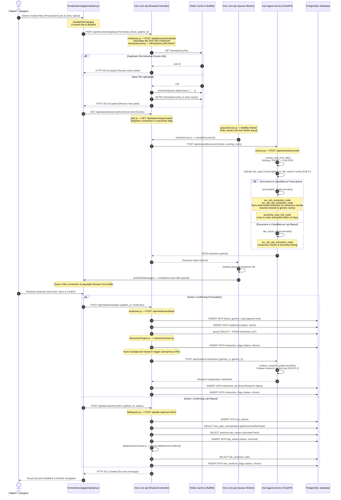

# MedGuard Ingestion Pipeline: End-to-End Technical Flow

This document provides a highly detailed walkthrough of the ingestion, parsing, classification, validation, and confirmation workflow for prescriptions and laboratory reports in MedGuard.

---

## 1. End-to-End Pipeline Sequence Diagram

---

## 2. In-Depth Technical Step Walkthrough

### Step 1: Frontend Ingestion
- **Source File**: [Upload.jsx](../frontend/src/pages/Upload.jsx), [useUploadQueue.js](../frontend/src/hooks/useUploadQueue.js)
- **Functions involved**:
  - `handleFileChange(e)`: Converts file content to a Base64 string using the browser's `FileReader` class to maintain state during browser refreshes and page reloads. **Before adding to the queue**, it calculates a SHA-256 content hash of each file via the Web Crypto API (`crypto.subtle.digest`) and compares it against all files already in the upload queue. If a duplicate is detected, the file is rejected with a user-facing alert (`"This file has already been uploaded."`). The `contentHash` is persisted to `sessionStorage` alongside the queue state to survive page refreshes. **Important**: This is an additive UX optimization layered in front of the existing ms1-core-api backend idempotency check (which uses Redis `idempotency:file:{checksum}` keys) — it does not replace that server-side check.
  - `handleUploadSingle(fileId)` / `handleUploadAll()`: Places the file inside a `FormData` object as a `photo` field and appends `patient_id`. It fires an HTTP POST request to `/api/documents/upload`.

### Step 2: Core API Ingestion & Checksum Validation
- **Source File**: [medicines.js](../ms1-core-api/src/routes/medicines.js)
- **Endpoint**: `POST /api/documents/upload`
- **Logic**:
  - Validates active user session and consent settings using `authenticateUser` and `enforceConsent('health_data_processing')`.
  - Reads physical file: `fs.readFileSync(req.file.path)`.
  - Calculates file checksum: `crypto.createHash('sha256').update(fileBuffer).digest('hex')`.
  - Checks duplicate upload status in Redis: `redisConnection.get("idempotency:file:{checksum}")`.
    - **Cache Hit**: Reuses the active `jobId` and immediately deletes the newly uploaded temporary physical file, returning HTTP 202.
    - **Cache Miss**: Generates a new `_traceparent` context header (`00-{traceId}-{spanId}-01`), enqueues the job in BullMQ: `extractionQueue.add('extract', { ... })`, caches the `jobId` mapping in Redis, and returns HTTP 202.

### Step 3: Server-Sent Events Status Stream
- **Source File**: [jobs.js](../ms1-core-api/src/routes/jobs.js)
- **Endpoint**: `GET /api/status/stream/:jobId`
- **Logic**:
  - Opens a keep-alive response channel: `Content-Type: text/event-stream`.
  - Registers the client response handle: `sseClients.set(jobId, res)`.
  - Returns initial `'queued'` status. If the job completed in the background before the client opened the stream, it reads the status using `extractionQueue.getJob(jobId)` and publishes the result.

### Step 4: Background Queue Processing & Service Bridge
- **Source File**: [queueService.js](../ms1-core-api/src/services/queueService.js)
- **Logic**:
  - The BullMQ worker consumes the job, decodes the `_traceparent` span identifier for tracing, and triggers `extractDocument(...)` in [visionService.js](../ms1-core-api/src/services/visionService.js).
  - `visionService.js` packages the file blob and triggers a `POST` request to `${MS2_BASE_URL}/api/extract/document`.

### Step 5: FastAPI Document Analysis & Graph Execution
- **Source File**: [extract.py](../ms2-agent-service/app/api/extract.py)
- **Logic**:
  - Extracts document text using `DocumentConverter()` (Docling) for clean markdown export, or falls back to page OCR using the VLM vision model if it is a scanned image/PDF.
  - Classifies the text using a GLM-5.2 orchestrator model with `classify_prompt` to get `doc_type` ("prescription" or "lab_report").
  - Routes the text to the appropriate LangGraph:
    - **Prescriptions**: Invokes `prescription_graph.ainvoke()` in [prescription_graph.py](../ms2-agent-service/app/graphs/prescription_graph.py).
      - `ocr_vlm_extraction_node`: Calls GLM-5.2 and Llama-3.1-70B. Resolves medicine brands to generics using `resolve_brand_to_generic()` and verifies consensus. Mismatches flag `needs_follow_up: true`.
      - `proximity_auto_link_node`: Searches dates in `existing_visits` context. If scheduled within 3 days, it auto-sets `proposed_visit_id`.
    - **Lab Reports**: Invokes `lab_report_graph.ainvoke()` in [lab_report_graph.py](../ms2-agent-service/app/graphs/lab_report_graph.py) to parse values and run date-proximity linking.
  - Returns output JSON, which the worker publishes via `sendSSEMessage()`.

### Step 6: Confirmation, Normalization & Safety Checks
The user reviews the extraction data and confirms the fields on the UI:

#### Flow A: Prescriptions
- **Endpoint**: `POST /api/medicines/batch` in [medicines.js](../ms1-core-api/src/routes/medicines.js).
- **Logic**:
  - Inserts brand-to-generic corrections in `brand_generic_map`.
  - Calculates `course_end_date` using `computeCourseEndDate()`.
  - Inserts medicines into `medicines` table.
  - Runs static check against `interaction_kb` via `checkInteractions()`. Flags conflicts in `interaction_flags`.
  - Spawns background task to query `/api/research-interaction` (ms2) to research safety details of the new drug combinations, writing the result in `interaction_kb` and creating alert flags.

#### Flow B: Lab Reports
- **Endpoint**: `POST /api/lab-reports/confirm` in [labReports.js](../ms1-core-api/src/routes/labReports.js).
- **Logic**:
  - Inserts record into `lab_reports`.
  - Maps test types to canonical names via `getCanonicalTestType()` using the `test_type_normalization` table.
  - Analyzes historical trends compared to previous results using `calculateTrend()`.
  - Saves the record in the `lab_values` table.
  - Triggers safety guidelines matching in [labMedicineChecker.js](../ms1-core-api/src/utils/labMedicineChecker.js). Safety violations are flagged in `lab_medicine_flags`.
