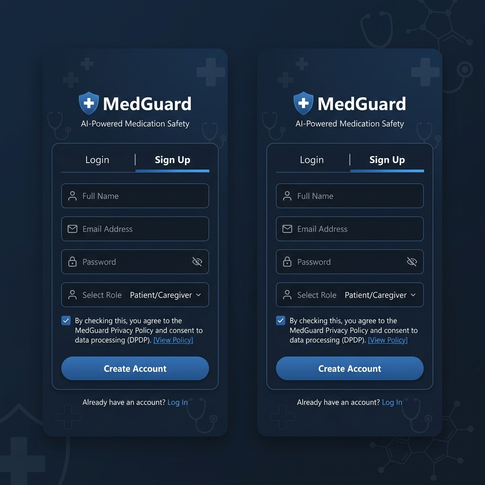
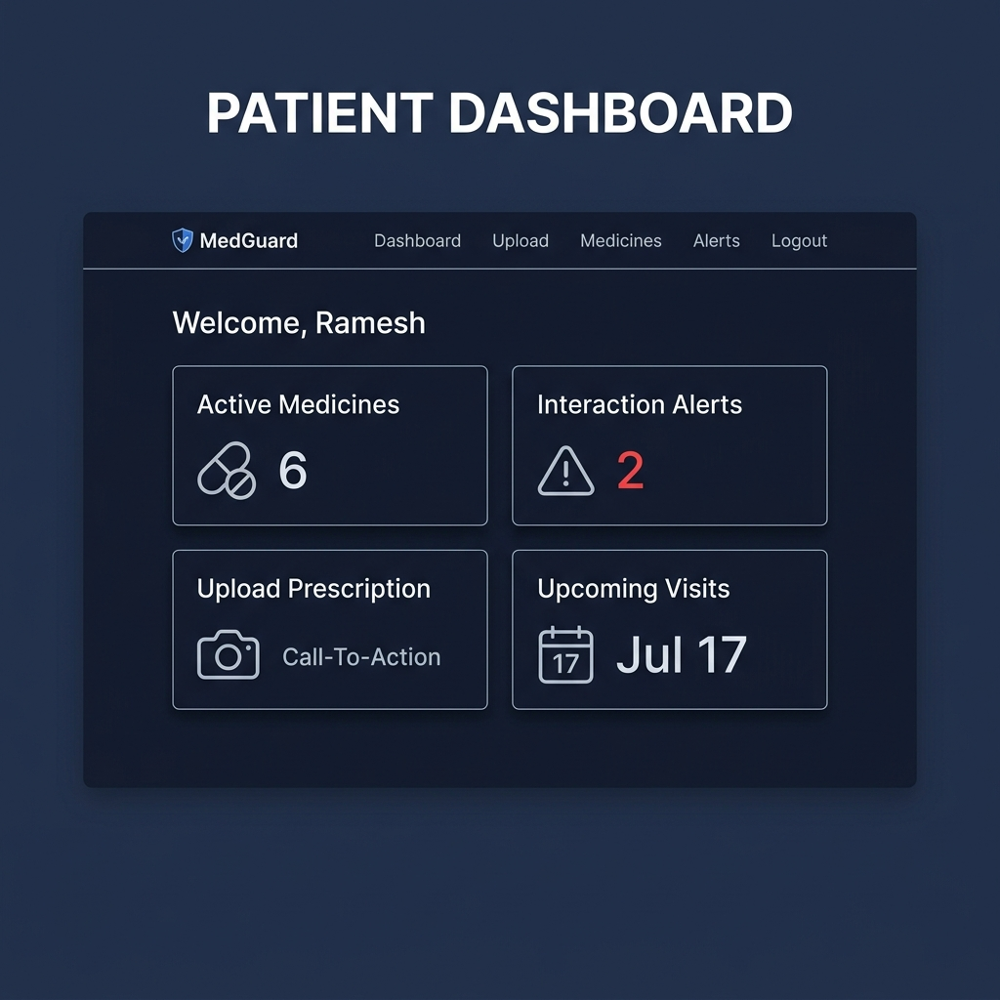
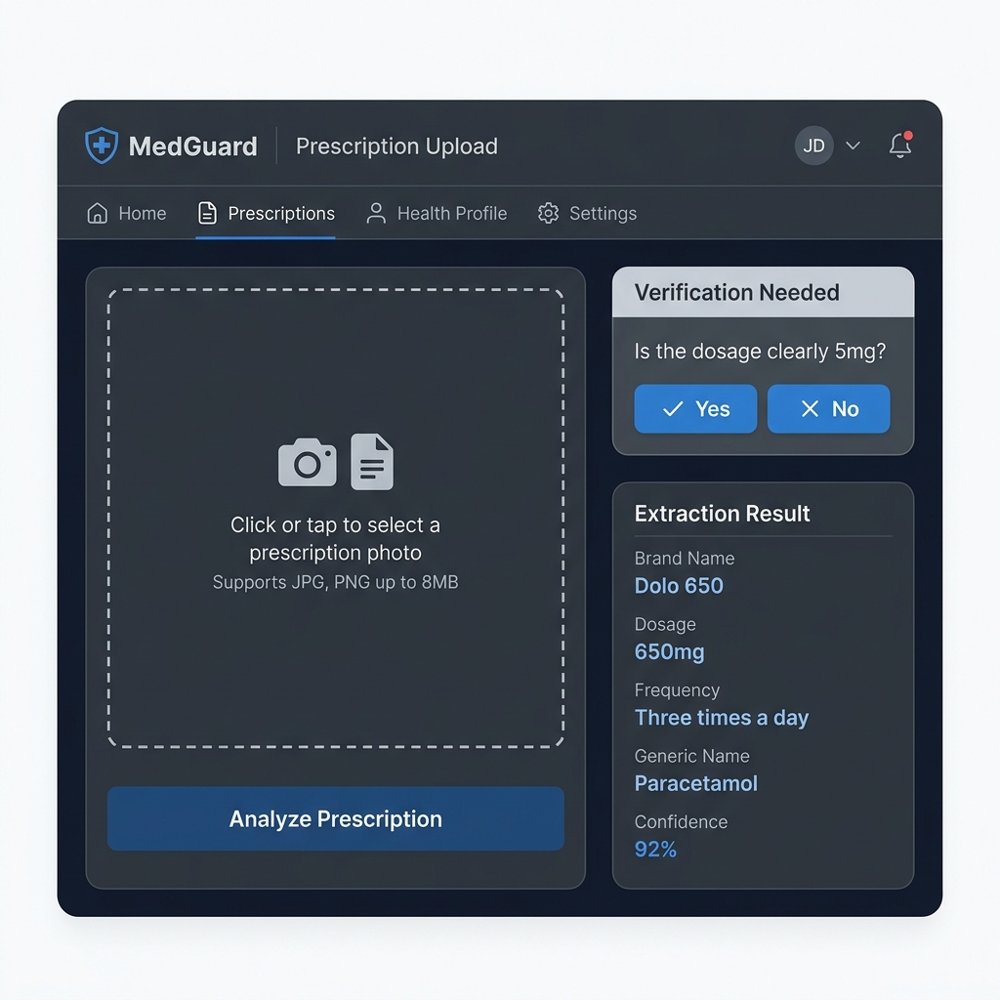
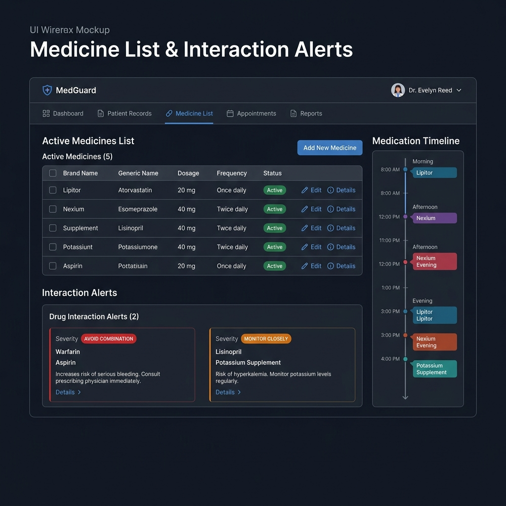
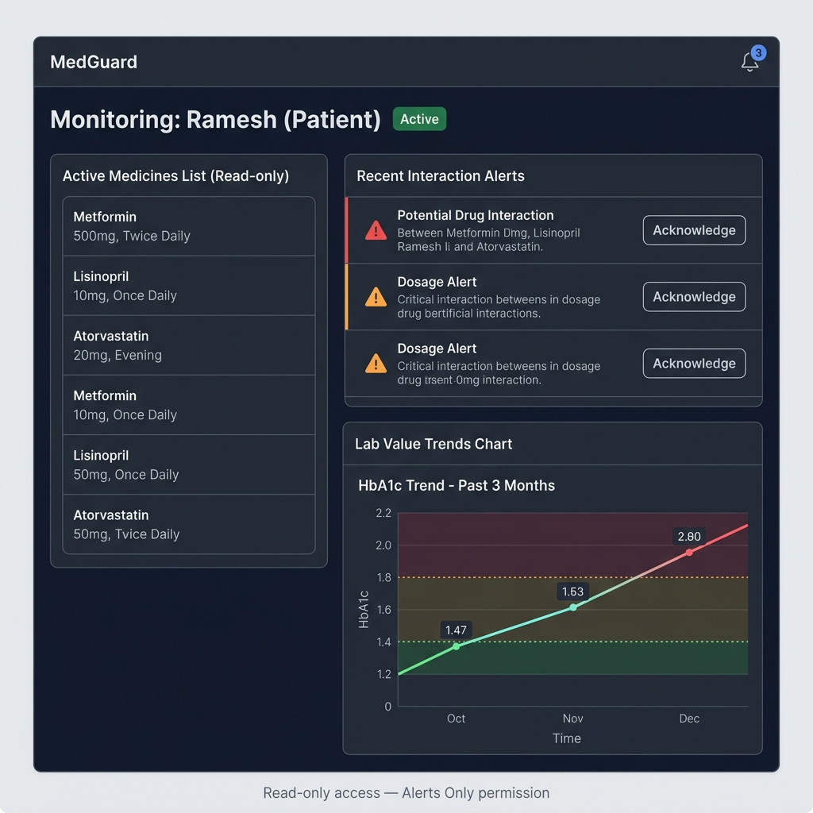
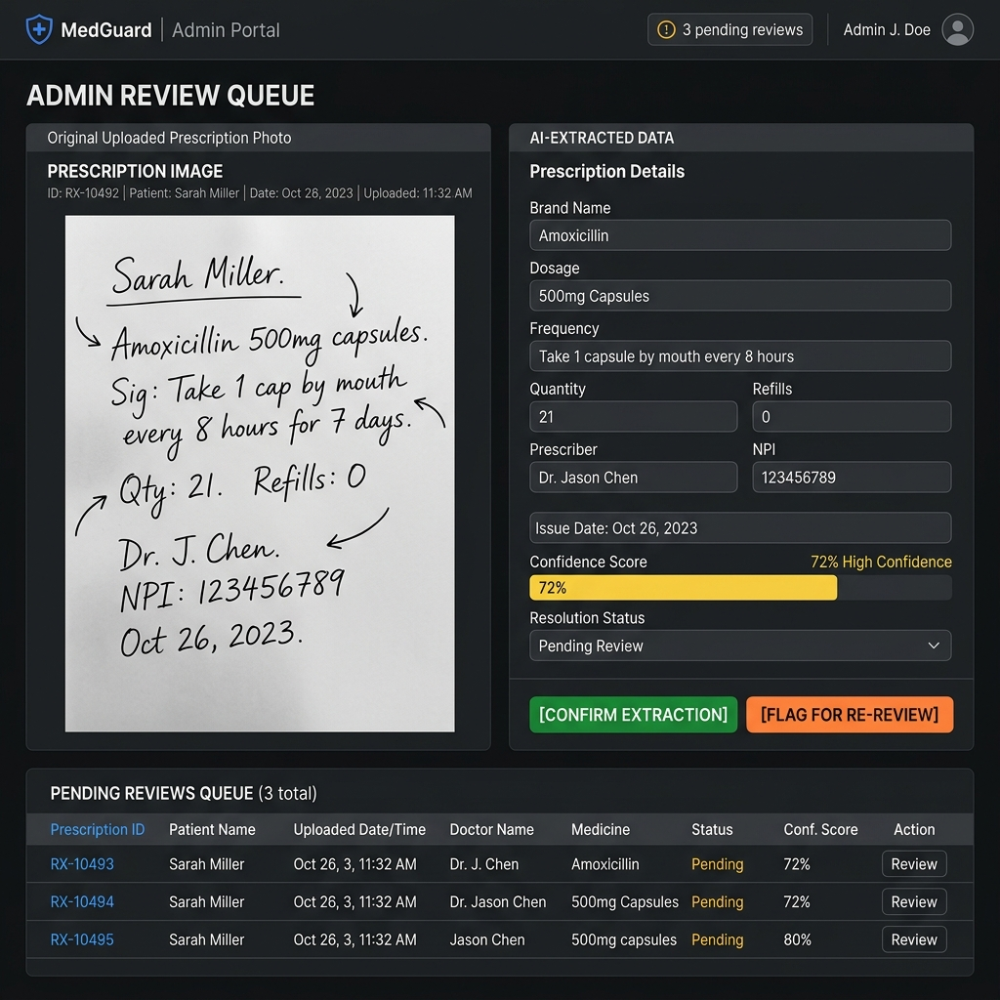

# MedGuard UI Wireframes

This document contains wireframe mockups for the 6 core screens of MedGuard.

---

## 1. Login / Signup

The authentication screen with DPDP consent checkbox for new signups.

**Key elements:**
- Login/Sign Up toggle tabs
- DPDP consent checkbox (required for registration)
- Role selection (Patient / Caregiver)
- JWT-based authentication

---

## 2. Patient Dashboard

The main landing page after login, showing a summary of the patient's medication safety status.

**Key elements:**
- Active medicines count
- Interaction alerts count with severity indicator
- Quick-access upload card
- Upcoming visits calendar

---

## 3. Prescription Upload

The prescription photo upload flow, including the AI follow-up question for ambiguous handwriting.

**Key elements:**
- Camera/file upload area (8MB limit)
- Real-time preview
- Follow-up question for ambiguous fields (≤1 question)
- Extraction result with confidence scores

---

## 4. Medicine List + Interaction Alerts

Combined view of the active medicine list and interaction warnings.

**Key elements:**
- Active/discontinued medicine table
- Severity-coded interaction alert cards
- Plain-language explanations
- Timeline view

---

## 5. Caregiver Dashboard

Read-only view for linked caregivers monitoring a patient's medication safety.

**Key elements:**
- Patient link with permission tier indicator
- Read-only medicine list
- Alert acknowledgment actions
- Lab value trend charts

---

## 6. Admin Review Queue

Clinical reviewer interface for correcting low-confidence extractions and managing the knowledge base.

**Key elements:**
- Side-by-side: raw photo vs. extracted fields
- Confidence score indicators
- Editable extraction fields
- Confirm / Flag for re-review actions
- Pending review queue table
